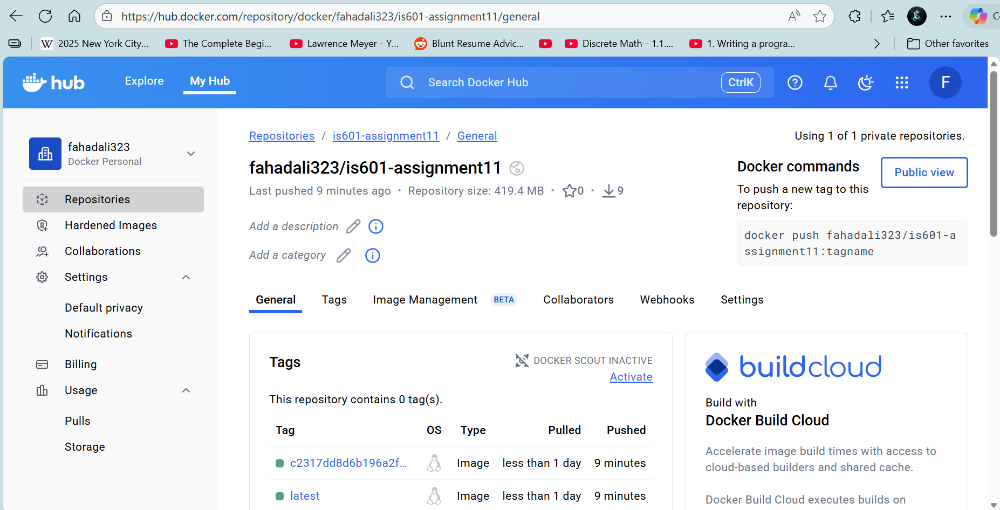

# 📦 Project Setup

---
## Screenshots
1. GitHub Actions Workflow:Screenshot showing a successful run of the GitHub Actions workflow.

2. Docker Hub Deployment: Screenshot demonstrating the Docker image has been successfully pushed to Docker Hub.

# Project Setup Guide

This guide explains how to fully set up the repository on a new machine
and start the Docker containers.

------------------------------------------------------------------------

## 📦 Prerequisites

Ensure the following are installed:

-   **Git**
-   **Docker** & **Docker Compose**
-   **Python 3.10+** (if running scripts locally)
-   **pip** (Python package manager)

------------------------------------------------------------------------

## 🚀 1. Clone the Repository

``` bash
git clone <your-repo-url>.git
cd <your-repo-folder>
```

------------------------------------------------------------------------

## 🛠 2. Create a `.env` File

Copy the example environment file:

``` bash
cp .env.example .env
```

Then edit `.env` and add your secrets:

``` bash
nano .env
```

------------------------------------------------------------------------

## 🛠 3. Python Dependencies

Copy the example environment file:

``` bash
python -m venv venv
```
Activate it:
``` bash
source venv/Scripts/activate
```
Install requirements:

``` bash
pip install --upgrade pip
pip install -r requirements.txt
```
------------------------------------------------------------------------

## 📁 4. Build and Start Containers

To build and run everything:

``` bash
docker compose up -d --build
```

To check running containers:

``` bash
docker ps
```

------------------------------------------------------------------------

## 🔄 5. Apply Database Migrations (if using Alembic/FastAPI)

``` bash
docker compose exec backend alembic upgrade head
```

------------------------------------------------------------------------

## 🧪 6. Run Tests

``` bash
docker compose exec backend pytest
```

------------------------------------------------------------------------

## 🛑 7. Stopping Services

``` bash
docker compose down
```

To also remove volumes:

``` bash
docker compose down -v
```

------------------------------------------------------------------------

## 🧼 8. Rebuilding from Scratch

``` bash
docker compose down -v
docker compose build --no-cache
docker compose up -d
```

------------------------------------------------------------------------

## 📝 Notes

-   If you change dependencies, rebuild:

``` bash
docker compose build backend
```

-   If using Trivy, run scans:

``` bash
trivy fs .
trivy image yourimagename
```

------------------------------------------------------------------------

## 🎉 Done!

Your environment is fully set up.
